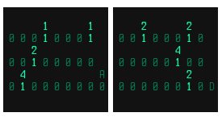

# BinClock

A binary clock made in Bash.

## Usage

`binclock [-h]|[-m]`

## Options

* `-h` show help and exit.
* `-m` display time in 24h format.

## Keybindings

* <kbd>c</kbd> change color.
* <kbd>q</kbd> quit.
* <kbd>r</kbd> redraw clock.

## Install

`make install`

## Uninstall

`make uninstall`

